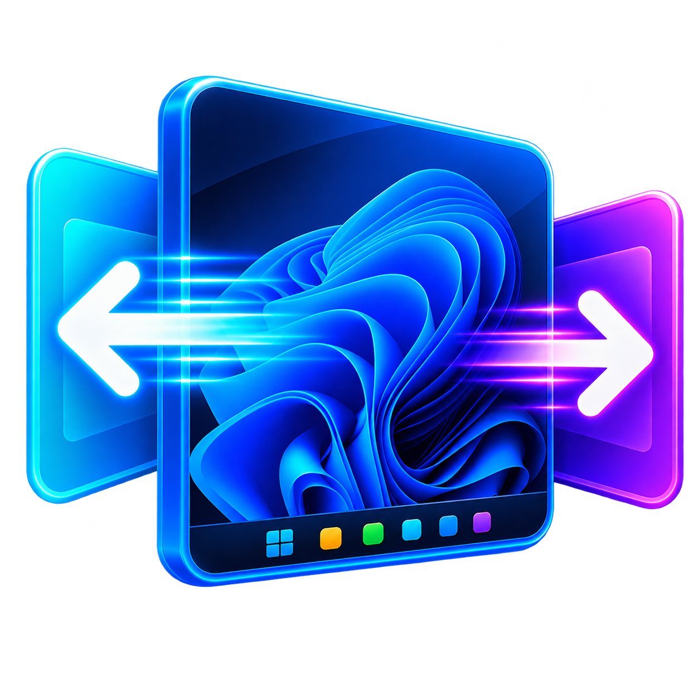

  

<h1 align="center">DeskSwipe</h1>

  Configurable three-finger virtual desktop switching for Windows touchpads.

  
  
  
  

  <a href="https://github.com/Sohmteee/DeskSwipe/releases/latest"><strong>Download latest release</strong></a>
  |
  <a href="ROADMAP.md">Roadmap</a>
  |
  <a href="CHANGELOG.md">Changelog</a>
  |
  <a href="CONTRIBUTING.md">Contributing</a>

---

DeskSwipe brings configurable three-finger virtual desktop switching to compatible Windows touchpads.

It was developed primarily for older Dell/ALPS touchpads that do not expose native Windows Precision Touchpad desktop gestures.

## Features

- Three-finger horizontal virtual desktop switching
- Native Windows desktop transitions
- macOS-style edge bounce feedback
- Configurable swipe direction
- Configurable edge behavior
- Soft, Balanced, and Firm bounce strengths
- Optional edge feedback messages
- Desktop name, desktop number, or Start/End message styles
- Configurable message duration
- Windows 11-style WinUI 3 Settings app
- System, Light, and Dark themes
- Start with Windows
- Optional Settings window at sign-in
- System tray menu
- Custom DeskSwipe icon

- Windows installer
- Desktop shortcut

## Settings

### Gestures

- Swipe direction: Natural or Reversed
- Edge behavior: Bounce or Do nothing
- Bounce strength: Soft, Balanced, or Firm

### Feedback

- Edge message on/off
- Message style: Start / End, Desktop name, or Desktop number
- Message duration: Short, Normal, or Long

### System

- Start with Windows
- Open Settings at sign-in
- Theme: System, Light, or Dark

Open Settings at sign-in is disabled by default.

## Launch behavior

Opening DeskSwipe manually opens the Settings window and ensures the background gesture runtime is running.

When Windows starts DeskSwipe automatically, the startup shortcut launches `DeskSwipeGestures.exe --startup`.

The gesture runtime starts silently by default.

If Open Settings at sign-in is enabled, the Settings window also opens.

## Tray menu

DeskSwipe runs in the notification area and provides:

- Settings
- Start with Windows
- About
- Quit

Double-clicking the tray icon opens Settings.

## How it works

On the target Dell/ALPS touchpad, three-finger horizontal flicks are exposed as the extended scan code `SC10F`.

DeskSwipe captures those gestures using AutoHotkey v2 and binds the scan code configured in Settings (`10F` by default).

Normal desktop changes use the native Windows shortcuts `Win + Ctrl + Left` and `Win + Ctrl + Right`.

At the first or last desktop, DeskSwipe can display a screenshot-based rubber-band bounce animation instead of attempting to wrap around.

## Components

### DeskSwipe.exe

C# / .NET helper responsible for the custom edge animation.

### DeskSwipeGestures.exe

Compiled AutoHotkey v2 runtime responsible for gesture detection, desktop switching, the tray menu, edge messages, and startup behavior.

### DeskSwipe.Settings.exe

WinUI 3 Settings application.

Settings are stored at `%APPDATA%\DeskSwipe\settings.json`.

## Technology

- C#
- .NET 8
- WinForms
- WinUI 3
- AutoHotkey v2
- VirtualDesktopAccessor
- Inno Setup

## Build requirements

- Windows 10 or Windows 11 x64
- .NET 8 SDK
- AutoHotkey v2
- Ahk2Exe
- Inno Setup 6

## Build

From the repository root, run `.\build.ps1`.

The portable build is created under `release\DeskSwipe\`.

The release directory contains:

- `DeskSwipe.exe`
- `DeskSwipeGestures.exe`
- `DeskSwipe.ico`
- `VirtualDesktopAccessor.dll`
- `Settings\DeskSwipe.Settings.exe`

The WinUI Settings application uses its normal Release build output rather than `dotnet publish`.

## Installer

Build DeskSwipe first with `.\build.ps1`.

Then compile the installer with Inno Setup using:

`& "C:\Program Files (x86)\Inno Setup 6\ISCC.exe" ".\installer\DeskSwipe.iss"`

The installer is generated at `release\DeskSwipe-Setup-0.2.1.exe`.

## Hardware compatibility

DeskSwipe was developed for older Dell/ALPS touchpads that expose three-finger horizontal flicks as keyboard-like scan-code events instead of native Windows Precision Touchpad gestures.

The verified development touchpad is a Dell ALPS touchpad with hardware ID `ACPI\DLL0532`.

The gesture implementation binds the scan code configured in Settings for three-finger horizontal flicks (default `10F`, matching the ALPS development hardware):

- `<!+` + scan code switches one desktop to the left
- `<!` + scan code switches one desktop to the right

If your touchpad emits a different scan code, set it under **Gestures → Gesture scan code** in Settings and DeskSwipe rebinds the gesture within a few seconds.

Other touchpads may require different gesture detection. If your touchpad uses Windows Precision Touchpad gestures, Synaptics, ELAN, HID-over-I2C, or a different ALPS driver, DeskSwipe may not detect three-finger swipes until broader gesture detection is added.

### Compatibility matrix

| Hardware or driver | Status | Notes |
| --- | --- | --- |
| Dell ALPS touchpad, `ACPI\DLL0532`, emitting `SC10F` | Verified | Original development target. |
| Other ALPS touchpads emitting `SC10F` | Likely compatible | Please report the laptop model, hardware ID, driver version, and observed scan codes if it works or fails. |
| Touchpads emitting a different keyboard-like scan code | Likely compatible | Enter your detected code in Settings under **Gesture scan code**. |
| Windows Precision Touchpad devices | Not supported by the current runtime | These usually expose gestures through Windows touch input rather than keyboard-like scan codes. |
| Synaptics, ELAN, HID-over-I2C, or unknown touchpads | Unknown | Open a compatibility report with hardware and scan-code details. |

### How to check your touchpad

1. Open Device Manager.
2. Find the touchpad under **Mice and other pointing devices** or **Human Interface Devices**.
3. Open **Properties**.
4. On the **Details** tab, select **Hardware Ids** and note the values.
5. On the **Driver** tab, note the provider, version, and date.
6. Use an AutoHotkey key history or scan-code viewer to check whether a three-finger horizontal flick emits `SC10F`.

## Troubleshooting

### Three-finger swipes do nothing

- Confirm DeskSwipe is running in the notification area.
- Confirm your touchpad emits `SC10F` for three-finger horizontal flicks, or set the code your touchpad emits in Settings under **Gesture scan code**.
- Confirm AutoHotkey hooks are not blocked by another gesture utility or touchpad driver tool.
- Try running DeskSwipe manually once, then use the tray menu to quit and start it again.
- If the touchpad emits a different scan code, set it in Settings under **Gesture scan code**, and open a bug report if it still fails.

### Windows changes desktops but DeskSwipe does not bounce at the edge

- Confirm `VirtualDesktopAccessor.dll` is next to `DeskSwipe.exe` in the portable or installed directory.
- Confirm edge behavior is set to **Bounce** in Settings.
- Confirm there is more than one virtual desktop.
- Check whether security software blocked `DeskSwipe.exe` from taking the temporary desktop screenshot used for the bounce animation.

### The tray icon is missing

- Check the hidden icons flyout in the Windows notification area.
- Start DeskSwipe again from the Start menu or portable folder.
- Confirm `DeskSwipe.ico` is present next to `DeskSwipeGestures.exe`.

### DeskSwipe does not start with Windows

- Open Settings and toggle **Start with Windows** off and on again.
- Confirm the startup shortcut exists at `%APPDATA%\Microsoft\Windows\Start Menu\Programs\Startup\DeskSwipe.lnk`.
- If Windows startup launches the app but Settings opens unexpectedly, check whether **Open Settings at sign-in** is enabled.

### Settings changes are not saved

- Confirm DeskSwipe can write to `%APPDATA%\DeskSwipe\settings.json`.
- Quit DeskSwipe from the tray menu, reopen it, and change the setting again.
- If the file exists but looks invalid, attach it to a bug report after removing any private information.

### What to include in a bug report

For gesture detection or compatibility issues, include:

- Windows version
- DeskSwipe version
- Laptop model
- Touchpad manufacturer/model
- Touchpad hardware ID
- Touchpad driver provider, version, and date
- Whether three-finger flicks emit `SC10F` or a different scan code
- Whether the tray icon appears
- Whether normal Windows shortcuts `Win + Ctrl + Left/Right` work

## Version

Current release: **v0.2.1**

## Credits

DeskSwipe uses VirtualDesktopAccessor for Windows virtual desktop information.

## License

DeskSwipe is licensed under the MIT License. See `LICENSE` for details.
